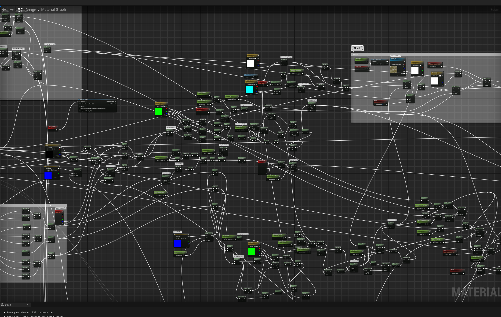
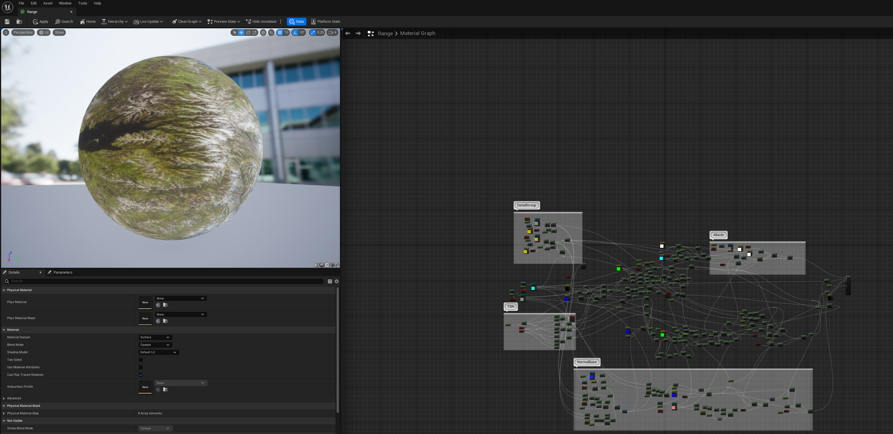

# TA Interview Show

## UE5.1 地形Shader

个人Unity项目中的地形Shader移植过来，在UE中使用材质编辑器复现了一遍,Albedo精度不够导致地形比较糊，当然地形的Albedo也不是用这一整张的方案

## 工业流水线项目

https://user-images.githubusercontent.com/37301000/249176981-8f3ac5fd-1f2b-41b0-9e7a-d1501160537c.mp4

## 夏日森林项目
https://user-images.githubusercontent.com/37301000/249351858-725eb63b-3d42-40a2-98b6-6cc637ba9200.mp4
